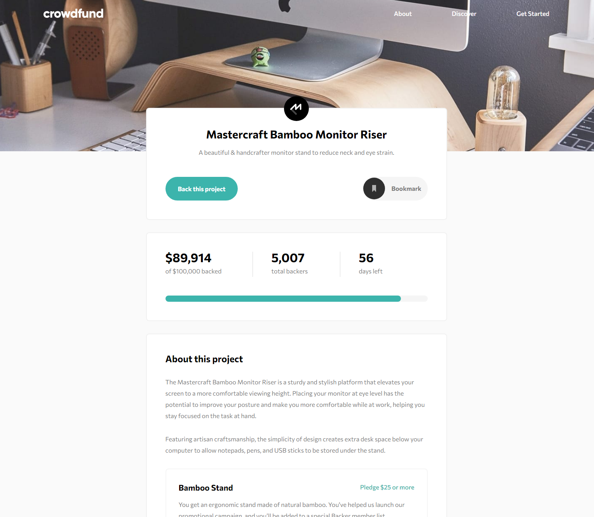

# Frontend Mentor - Crowdfunding product page solution

This is a solution to the [Crowdfunding product page challenge on Frontend Mentor](https://www.frontendmentor.io/challenges/crowdfunding-product-page-7uvcZe7ZR). Frontend Mentor challenges help you improve your coding skills by building realistic projects.

## Table of contents

- [Overview](#overview)
  - [The challenge](#the-challenge)
  - [Screenshot](#screenshot)
  - [Links](#links)
- [My process](#my-process)
  - [Built with](#built-with)
  - [What I learned](#what-i-learned)
  - [Continued development](#continued-development)
  - [Useful resources](#useful-resources)
- [Author](#author)
- [Acknowledgments](#acknowledgments)

**Note: Delete this note and update the table of contents based on what sections you keep.**

## Overview

### The challenge

Users should be able to:

- View the optimal layout depending on their device's screen size
- See hover states for interactive elements
- Make a selection of which pledge to make
- See an updated progress bar and total money raised based on their pledge total after confirming a pledge
- See the number of total backers increment by one after confirming a pledge
- Toggle whether or not the product is bookmarked

### Screenshot

### Links

- Github URL: [Github URL](https://github.com/exchyphen/fm_crowdfunding-product-page)
- Live Site URL: [live site hosted by Github Pages](https://exchyphen.github.io/fm_crowdfunding-product-page/)

## My process

### Built with

- HTML
- CSS
- JavaScript
- Reacct

### What I learned

Practice with modals, practice with BEM and CSS classes/structure.
Connecting various pieces of data and having a controlling component - in this case connecting the pledge amount, number of backers, stock remaining.

### Continued development

When a modal is active, ensure all elements in the background are inactive/non-clickable.
Would like to restructure and rename CSS classes for clarity.

## Author

- Github - [exchyphen](https://github.com/exchyphen)
- Frontend Mentor - [@exchyphen](https://www.frontendmentor.io/profile/exchyphen)
